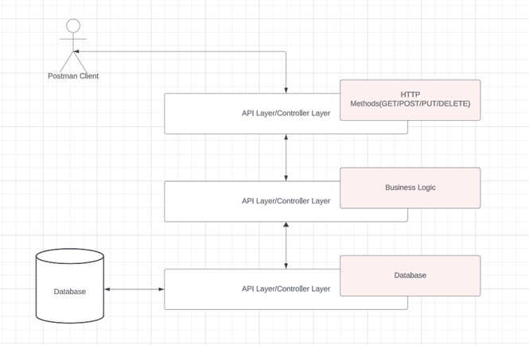

  

## Abstract

In today's interconnected world, REST APIs have become the backbone of modern web and mobile applications, facilitating seamless communication between various software components. At the heart of building robust and efficient RESTful services stands Spring Boot, a powerful and developer-friendly framework. Spring Boot's simplicity and convention-over-configuration approach make it the go-to choice for creating RESTful APIs effortlessly. In this guide, we delve into the world of RESTful architecture and Spring Boot, exploring how they work together to empower developers in crafting high-performance web services. We begin by defining what a REST API is and how it operates. We then explore the advantages and disadvantages of using an H2 in-memory database in Spring Boot applications. Next, we introduce the Spring Boot Initializer, a powerful tool for simplifying project setup and dependency management. Additionally, we discuss the selection of an Integrated Development Environment (IDE) for Spring Boot development, providing insights into commonly used IDEs. The guide concludes with instructions on how to open a Spring Boot project, run the application, and utilize Postman for API testing.

This comprehensive guide equips developers with the knowledge and tools needed to harness the potential of RESTful APIs and Spring Boot, empowering them to build efficient and responsive web services in today's fast-paced software development landscape.

## Introduction

In today's interconnected world, REST (Representational State Transfer) APIs have become the backbone of modern web and mobile applications, facilitating seamless communication between various software components. At the heart of building robust and efficient RESTful services stands Spring Boot, a powerful and developer-friendly framework. Spring Boot's simplicity and convention-over-configuration approach make it the go-to choice for creating RESTful APIs effortlessly. In this era of rapid software development, understanding how to harness the capabilities of REST APIs and Spring Boot is essential for building scalable, maintainable, and responsive applications. In this guide, we'll delve into the world of RESTful architecture and Spring Boot, exploring how they work together to empower developers in crafting high-performance web services.

## What is a REST API

A REST API (Representational State Transfer API) is a way for two applications to communicate with each other over the internet. REST APIs are based on the HTTP protocol, which is the same protocol that web browsers use to request and receive web pages. REST APIs use HTTP verbs to define the different operations that can be performed on a resource, such as GET, POST, PUT, and DELETE.

For example, a REST API for a blog might have a resource for posts. The GET verb could be used to retrieve a list of all posts, the POST verb could be used to create a new post, the PUT verb could be used to update an existing post, and the DELETE verb could be used to delete a post.

REST APIs are a popular way to build web applications because they are easy to use and understand. They are also very scalable, which means that they can be used to support large numbers of requests.

### Benefits of Using REST APIs

- They are easy to use and understand.
- They are scalable.
- They are interoperable, meaning that they can be used by applications written in different programming languages.
- They are stateless, which means that each request is independent of the previous request.

If you are building a web application, REST APIs are a good option to consider. They are a reliable and efficient way to allow different applications to communicate with each other.

## How does REST API work

A REST API, which stands for Representational State Transfer Application Programming Interface, is a way for different computer programs or systems to communicate with each other over the internet. It's like a waiter taking your order at a restaurant and bringing your food to your table.

Here's how it works in simple terms:

1. **Resources:** Imagine each piece of information on a website or web application, like a user profile or a list of products, as a resource. These resources have unique addresses, like web URLs.
2. **HTTP Requests:** To interact with these resources, you send HTTP requests (like clicking links in a web browser). There are different types of requests:
   - **GET:** To retrieve information (like viewing a webpage).
   - **POST:** To create new data (like submitting a form).
   - **PUT:** To update existing data (like editing a profile).
   - **DELETE:** To remove data (like deleting a post).
3. **HTTP Responses:** When you make a request, the server responds with data (usually in a structured format like JSON or XML). This data can be text, images, or anything else your application needs.
4. **Stateless:** REST APIs are "stateless," which means each request should contain all the information needed, and the server doesn't remember previous requests. It's like ordering each dish separately at a restaurant.
5. **URLs:** Resources are identified by unique URLs, making it easy to access and manipulate them.

In summary, a REST API is like a menu at a restaurant, where you send requests to access or modify specific items, and you get back the information or actions you requested. It's a standard way for different software systems to talk to each other and share data over the internet.

## REST API in Spring Boot

In Spring Boot, a REST API is a way to build web services that allow different software applications to communicate with each other over the internet using the principles of Representational State Transfer (REST).

Here's a simple explanation:

Spring Boot is a framework for building web applications, and REST API is a way to make these applications accessible over the web. With Spring Boot, you can create endpoints (like web addresses) that represent different resources or pieces of information in your application, such as user profiles or products in an online store.

You use HTTP requests (like clicking links in a web browser) to interact with these endpoints. For example, you can send a GET request to retrieve data, a POST request to create new data, a PUT request to update data, or a DELETE request to remove data.

Spring Boot simplifies the process of building and deploying REST APIs, making it easier for developers to create web services that can be used by other applications or devices. It's like building a menu for your application, allowing others to order and interact with your data over the internet.

## H2 In-memory Database

An H2 in-memory database is a lightweight and efficient database system often used in software development and testing environments. Unlike traditional databases, H2 doesn't persist data to disk; instead, it stores data in memory, making it incredibly fast for temporary data storage and retrieval during application development.

### Advantages of H2 in-memory databases:

1. **No Installation Overhead:** H2 doesn't require a separate database server installation, making it easy to set up and use in various development and testing environments. It's a simple, embedded database.
2. **Isolation:** Each instance of an H2 in-memory database is isolated from others, ensuring that changes made in one instance don't affect others. This is beneficial for parallel testing and development.
3. **Lightweight:** H2 is a compact and lightweight database system, consuming minimal system resources, which is advantageous for resource-constrained environments or when multiple databases are needed.
4. **Compatibility:** It supports standard SQL and JDBC (Java Database Connectivity), making it compatible with most programming languages and frameworks, including Java and Spring Boot.
5. **Speed:** H2 in-memory databases are incredibly fast because they store data in RAM (memory) rather than on disk. This results in rapid data retrieval and manipulation, which is especially useful for testing and development.

### Disadvantages of H2 in-memory databases:

1. **Limited Storage:** The amount of data that can be stored in an H2 in-memory database is limited by available RAM, making it impractical for large datasets or applications with extensive data needs.
2. **Not for Production:** H2 in-memory databases are intended for development and testing purposes only. They lack the durability and reliability features required for production systems.
3. **Single-User:** H2 databases are typically single-user and are not suitable for multi-user concurrent access, which is a common requirement for production databases.
4. **Lack of Advanced Features:** H2 may lack some advanced features and optimizations found in larger, production-oriented databases like PostgreSQL or Oracle.
5. **Data Loss:** Since H2 databases are in-memory, all data is lost when the application shuts down. This makes them unsuitable for storing persistent data in production environments.

## Creating a REST API Application using Spring Boot

### Spring Boot Initializer

Spring Boot Initializer is a web-based tool provided by the Spring team that simplifies the process of creating and configuring Spring Boot applications. It's also known as the "Spring Initializr." This tool streamlines the setup of Spring Boot projects by allowing developers to generate a project structure with the necessary dependencies and configurations quickly.

Here are some key points about Spring Boot Initializer:

1. **Web-Based Interface:** Spring Boot Initializer is accessible through a web browser. Developers can visit the [Spring Initializr website](https://start.spring.io/) or integrate it into their integrated development environment (IDE) like Spring Tool Suite (STS) or use it as a command-line tool.
2. **Project Customization:** Developers can customize their projects by selecting options such as the project's programming language (Java, Kotlin, Groovy), packaging type (JAR or WAR), and Spring Boot version.
3. **Dependency Management:** One of the most powerful features is the ability to add dependencies to your project. These dependencies include Spring modules, databases, security features, and more. The tool generates a project structure with the specified dependencies pre-configured.
4. **Generated Project:** After configuring the project, developers can download a ZIP file containing the generated project structure. This project structure includes a Maven or Gradle build file, a basic application class, and the necessary configuration files.
5. **Starter Templates:** Spring Boot Initializer offers starter templates for common project types, such as RESTful APIs, web applications, and microservices. These templates come pre-configured with relevant dependencies and settings.
6. **IDE Integration:** Many popular integrated development environments (IDEs), including IntelliJ IDEA and Eclipse, have plugins or integrations that allow developers to create Spring Boot projects using the Initializr directly from the IDE.

It helps you start with the basic structure of any application you want to build. Also, it generates the code for you and saves your time by generating the `pom.xml` and basic paths folders so that you can quickly start working on the main project.

### IDE Selection

Choosing the right Integrated Development Environment (IDE) for developing a Spring Boot application is crucial for productivity and efficiency.

Commonly used IDEs for Spring Boot development include:

- **IntelliJ IDEA:** Known for its excellent Java and Spring Boot support, it offers a free Community Edition and a paid Ultimate Edition with more features.
- **Eclipse:** Spring Tool Suite (STS) is an Eclipse-based IDE explicitly designed for Spring development. Eclipse itself, with appropriate plugins, is also used for Spring Boot development.
- **Visual Studio Code:** A lightweight, open-source IDE with a wide range of extensions, it's gaining popularity for Spring Boot development.
- **NetBeans:** While not as popular as IntelliJ or Eclipse, NetBeans also provides Java and Spring support and is known for its ease of use.

For this documentation, I have used Eclipse IDE, an IDE similar to STS. Always remember to select an IDE; you need to consider several things such as performance, plugin ecosystem, integration with other tools, ease of use, and personal preference. These play an integral part in choosing an IDE and help you plan better for your project ahead.

### Opening the Project

1. Open Eclipse and Select File
2. Select Import Project
3. Select “Maven” and hit enter
4. Select “Import an Existing Maven project”
5. Browse for the path where the project is located and then hit Finish
6. The IDE will load all the dependencies, files, and necessary items needed for the project's working

### Model-View-Controller

MVC stands for Model-View-Controller, which is a design pattern commonly used in software development, especially in building web applications. It helps in separating an application into three interconnected components, each with its specific responsibilities.

Here's a brief overview of each component:

1. **Model:** The Model represents the application's data and the business logic for manipulating that data. It is responsible for managing the state of the application, retrieving and storing data, and implementing the core logic. In web applications, the Model often interacts with a database to retrieve and persist data.
2. **View:** The View is responsible for the presentation layer and how the data is displayed to the user. It handles the user interface (UI) and user experience (UX) components, such as HTML templates, forms, and the visual representation of data. Views are typically passive and rely on the Model for data.
3. **Controller:** The Controller acts as an intermediary between the Model and the View. It receives user input from the View, processes it, interacts with the Model to perform the necessary actions, and updates the View accordingly. Controllers handle the application's flow and business logic, making decisions based on user input and application state.

In a Spring Boot application following the Model-View-Controller (MVC) architecture, you would typically create model classes, controller classes, and repository classes to manage the application's data, control its flow, and interact with a database. Here's a brief overview of each type of class:

1. **Model Classes:**
   Model classes represent the data structures used in your application. These classes define the data schema and contain fields that represent the properties of your domain objects. In Spring Boot, these classes are often annotated with `@Entity` (if using JPA) to mark them as entities for database storage.
2. **Controller Classes:**
   Controller classes handle incoming HTTP requests, process them, and return appropriate responses. These classes are responsible for controlling the flow of the application. They often use service classes to interact with the model and perform business logic. Controller methods are typically annotated with `@Controller` and specific request mapping annotations like `@GetMapping` or `@PostMapping`.
3. **Repository Classes:**
   Repository classes are responsible for interacting with the database to perform CRUD (Create, Read, Update, Delete) operations. In Spring Boot, you can use Spring Data JPA repositories for this purpose. These repositories extend the `JpaRepository` interface and provide methods for common database operations.

In a Spring Boot application, these classes work together to create a complete MVC architecture, where the model represents the data, the controller handles user requests and business logic, and the repository manages database interactions. This separation of concerns helps in building scalable and maintainable applications.

### Run the Application

When you generate the zip file using Spring Initializer and open it in your IDE, you will notice a Java class in your package `com.example.demo`. This Java class will be responsible for running your Spring Boot application. After you are done with your code, go to this class, right-click on it and Select “Run As”. In Run As, select Run as “Java Application.” The Spring Boot will be initialized and will start the application on port 8080 (You may change this port accordingly in the `application.properties` file).

Once you are able to run the code, you may test your APIs using Postman.

### Postman

Postman is a handy computer program that helps people test and manage their web services, like websites and apps, in a simple and organized way. It allows you to send requests to a website or service and see what it sends back. This helps developers make sure everything is working correctly. Postman also lets you save and organize your tests so you can use them again later. It's a valuable tool for people who work on websites and apps to make sure they run smoothly.

Once you are done with your APIs, open Postman and start testing them. If you don’t know how to use, refer to the [Postman documentation](https://www.postman.com/docs/) for your ease.

## Appendix

### Appendix A: High Level Architecture Diagram

The high-level architecture style is the overview of any software. In this particular scenario, the high-level architecture depicts the flow of the services and APIs to make the system work.

  

